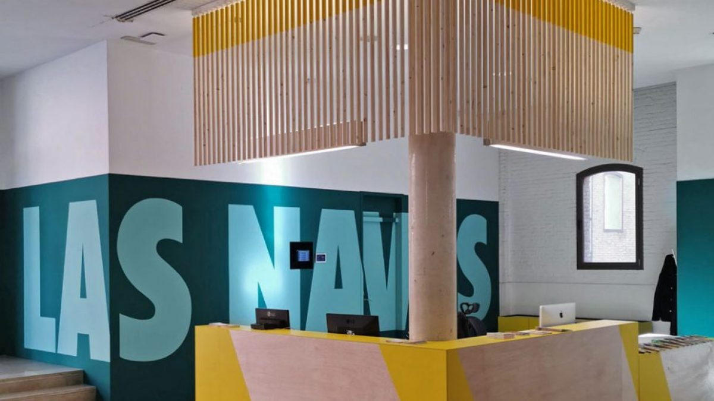

# Las Naves Backend 

Hello, and thank you for checking out my Naves Coworking backend project! I hope you enjoy exploring it. 🚀
<br><br>

</a>

<details>
  <summary>Table of Contents</summary>
  <ol>
 <li><a href="#description">Description</a></li>
    <li><a href="#objetive">Objetive</a></li>
    <li><a href="#stack">Stack</a></li>
    <li><a href="#database-schema">Database Schema</a></li>
    <li><a href="#local-installation">Local installation</a></li>
    <li><a href="#future-functionalities️">Future functionalities</a></li>
    <li><a href="#development">Development</a></li>
    <li><a href="#appreciations">Appreciations</a></li>
    <li><a href="#contact">Contact</a></li>
  </ol>
</details>
<br>

## Description
The purpose of this project is to revolutionize the way coworking spaces are managed, creating a fully automated and seamless experience. Through a cutting-edge application, the goal is to streamline access control, allowing instant registration of user movements. Additionally, the platform will provide an efficient system for managing workroom bookings and generate detailed administrative reports, facilitating more strategic decision-making. Everything is designed to offer modern and accessible management, tailored to the needs of today’s shared workspaces.
<br><br>


## Objetive
The goal of this platform is to simplify the management of access and room reservations, offering an efficient and user-friendly solution that optimizes space administration. Users will be able to log their entries, book rooms, and review their past activities, while administrators will have access to detailed reports and statistical data that facilitate resource management. The platform focuses on maximizing efficiency, improving organization, and ensuring an accessible and secure environment for everyone.
<br><br>


## Stack
<div align="center">
<a>
    
</a>
<a>
    
</a>
<a>
    
</a>
<a>
    
</a>
<a>
    
</a>
<a>

</a>
<a>
    
</a>
<a>
    
</a>
</div>

## Database Schema

    - Person - Access: A person can be linked to several different accesses. One-to-many relationship.

    - Room - Access: A room can register multiple accesses. One-to-many relationship.

    - Person - Access History: Each person can have multiple access records in their history. One-to-many relationship.

    - Room - Access History: Each room can have several records in its access history. One-to-many relationship.

    - Access - Access History: Each individual access creates a corresponding record in the access history. One-to-one relationship.

## Local installation Backend

1. Install docker and create a mysql container
2. Clone the repository
3.  ``` $ npm install  ```
4. We connect our repository with the database
5. ``` $ npm run dev ``` 
6. ``` $ We execute the migrations $ npm run migrate ``` 
7. ``` $ We run the seeders $ npm run db:seed ``` 

### Local installation Frontend

1. Clone the repository
2. ``` $ npm install  ```
3. ``` $ npm run dev ```

## Future functionalities

- Integration with virtual assistants to manage reservations and requests via voice commands.

-Real-time occupancy analytics to optimize space usage.

- Automated notifications for relevant events or meetings based on user interests.

- Personalization of the work environment by adjusting lighting, temperature, or music in reserved rooms.

## Development 👨🏻‍💻

```js
const developer = "SantiagoAlfaro";

console.log("Developed by: " SantiagoAlfaro);
```

## Appreciations

I want to express my gratitude to the instructors at Geeks Hubs and my colleagues, who continuously support one another in overcoming challenges.

## Contact
**Santiago Alfaro Martí**
  - [GitHub](https://github.com/SantiagoAlfaroMarti)
  - [Linkedin](https://www.linkedin.com/feed/)